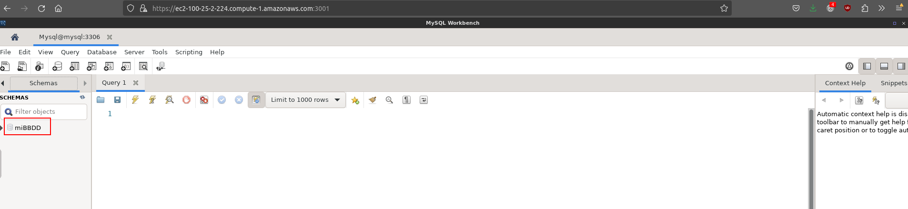
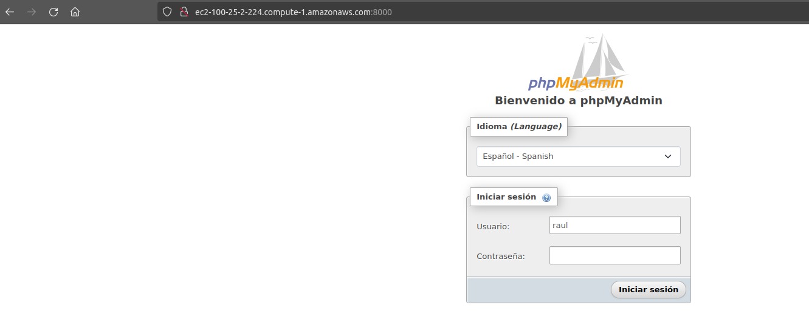

## Instrucciones para levantar el escenario

Este escenario permite levantar una base de datos MySQL 8 (podría elegirse otra versión sin problemas).

De forma adicional, puede levantar un contenedor con MySQL Workbench y/u otro con PHPmyadmin para interactuar con la base de datos.

De forma predeterminada, la parte para correr el contenedor con MySQL Workbench está comentada (líneas resaltadas más abajo) pero bastaría con descomentarlas. 

También por defecto corre el contenedor con PHPmyadmin, si no fuera necesario podrían comentarse las líneas apropiadas (de la 33 a la 44).


```yaml title="docker-compose.yml" hl_lines="2-16" linenums="1"
services:
  # mysql-workbench:
  #   image: lscr.io/linuxserver/mysql-workbench:latest
  #   container_name: mysql-workbench
  #   environment:
  #     - PUID=1000
  #     - PGID=1000
  #     - TZ=Etc/UTC
  #   volumes:
  #     - /directorio/con/la/configuracion:/config # (1)
  #   ports:
  #     - 3000:3000 # (2)
  #     - 3001:3001 # (3)
  #   cap_add:
  #     - IPC_LOCK
  #   restart: unless-stopped

  base-datos:
      image: mysql:8.0
      container_name: mysql
      ports: # (4)
          - "33306:3306" 
      environment: # (5)
          MYSQL_DATABASE: ${MYSQL_DB}
          MYSQL_USER: ${USUARIO_MYSQL}
          MYSQL_PASSWORD: ${PASSWORD_USUARIO_MYSQL}
          MYSQL_ROOT_PASSWORD: ${PASSWORD_ROOT_MYSQL}
      volumes:
          - persistente:/var/lib/mysql # (6)
      networks:
        - redBBDD # (7)

  phpmyadmin:
        image: phpmyadmin/phpmyadmin
        container_name: phpmyadmin-mysql
        ports:
            - 8000:80 # (8)
        environment: 
            MYSQL_USER: ${USUARIO_MYSQL}
            MYSQL_PASSWORD: ${PASSWORD_USUARIO_MYSQL}
            MYSQL_ROOT_PASSWORD: ${PASSWORD_ROOT_MYSQL}
            PMA_HOST: mysql
        networks:
          - redBBDD

volumes:
    persistente:

networks:
    redBBDD: 
```

1. Por si queremos pasarle alguna configuración a MySQL Workbench, la meteríamos en un directorio que luego mapeamos al contenedor
2. Accedemos a la aplicación mediante HTTP: `http://localhost:3000`
3. Accedemos a la aplicación mediante HTTPS: `https://localhost:3001`
4. El puerto 3306 del contenedor MySQL, se corresponderá con el puerto 33306 de nuestra máquina.
   
    Estas líneas sólo son necesarias si pretendemos acceder directamente al servidor de base de datos desde otro equipo (un phpmyadmin local, por ejemplo), en caso contrario podríamos comentarlas las dos.

5. Estas variables de entorno vienen definidas en el fichero `.env` y se pueden cambiar a nuestro antojo
6. Con este volumen haremos que los datos del contenedor de la base de datos persistan en nuestro propio equipo y no se pierdan aunque el contenedor se pare o elimine
7. Creamos una red compartida por los contenedores, de esta forma podrán identificarse unos a otros únicamente por el nombre sin hacer uso de la IP
8. Para acceder a PHPMyadmin desde el navegador, usaremos el puerto 8000 de nuestra máquina: `http://localhost:8000`

Así las cosas, para levantar el escenario bastará con abrir el terminal, posicionarse en el directorio donde este el archivo `docker-compose.yml`y ejecutar el comando:

```console
$ docker-compose up -d
```

Podremos acceder a cualquiera de las dos aplicaciones que hayamos levantado (SLQ Workbench/PHPMyadmin) y configurar el acceso a la base de datos con las credenciales que hayamos configurado en nuestras variables de entorno, poniendo como host destino `mysql` (el *container_name* del contenedor de la base de datos) y como puerto, el **33306**

Accedemos a SQL Workbench en el puerto **3000**. En mi caso la URL no es `localhost`porque no he desplegado los contenedores en mi máquina sino en AWS:


Si queremos acceder de forma segura, emplearemos **https** y el puerto 3001:


!!!note "Nota"
    Nos dará un aviso porque está utilizando certificados autofirmados. Habrá que decirle que haga una excepción.

Configuraremos el servidor de BBDD al que conectarnos:


En **hostname** bastará que pongamos `mysql`porque es el nombre que le hemos dado a nuestro contenedor con la base de datos. 

Como además hemos configurado en el *docker-compose.yml* que todos los contenedores estén en la misma red, son capaces de comunicarse simplemente por el nombre:


Nos pedirá la contraseña:


Y estamos dentro de nuestro servidor MySQL. Podemos ver que aparece la base de datos que le indicamos en las variables de entorno que debía crear:



El mismo proceso para **phpmyadmin**:




Si quisiéramos conectarnos directamente a la base de datos desde un equipo remoto, debemos haber dejado la directiva *ports* sin comentar y acceder al puerto **33306**:


