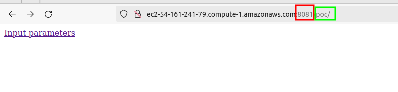
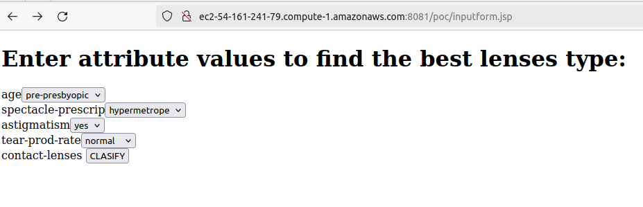
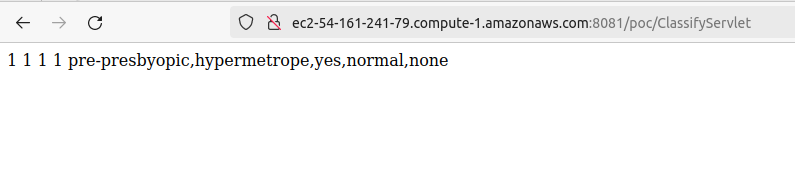

## Instrucciones para levantar el escenario

Este escenario es de los más sencillos. Hace uso de un servidor de aplicaciones Tomcat para ejecutar una aplicación Java, previamente compilada y empaquetada en un **.war**

Dependiendo de la versión de Java utilizada, se deberá utilziar una versión de Tomcat u otra. En este caso utilizaremos una versión un poco obsoleta ya que la aplicación de muestra está algo desfasada.

En caso de desarrollos en Java 11 o superiores, podríamos utilizar ya a partir de la versión 10 de Tomcat. Algo más de detalle [aquí](https://raul-profesor.github.io/Despliegue/P3.1-Tomcat/#por-que)

En cualquier caso, utilizaremos un único contenedor. Por este motivo nos basta con un `Dockerfile`y no necesitamos utilizar `docker compose`para tener un escenario multicontenedor.

Sería tan simple como:

```Dockerfile
FROM tomcat:7.0 # (1)

COPY ./aplicacion/poc.war /usr/local/tomcat/webapps # (2)
```

1. Imagen con la versión de Tomcat indicada que se utilizará para crear el contenedor
2. Al construir el contenedor, copia el fichero **poc.war** al directorio destinado a servir las aplicaciones en un servidor Tomcat

Para construir y correr el contenedor, en el terminal y situados en el directorio del proyecto (donde está el *Dockerfile*) basta con hacer:

```console
$ docker image build -t raul/tomcat_poc . # (1)

$ docker container run --publish 8081:8080 raul/tomcat_poc # (2)
```

1. Construye la imagen del contenedor a partir del Dockerfile que se encuentra en el directorio actual (`.`) y como nombre ponle `raul/tomcat_poc`
2. Corre el contenedor mapeando el puerto 8080 de Tomcat en el contenedor, con el  puerto 8081 de la máquina donde esté corriendo el contenedors

Una vez corriendo el contenedor, no nos queda más que acceder al servidor (localhost si es nuestra máquina, IP o nombre de dominio si es una remota):



Accedemos al puerto 8081 y al directorio `poc`que es como hemos llamado al .war de nuestra aplicación.

Y corroboramos que todo funciona correctamente:



