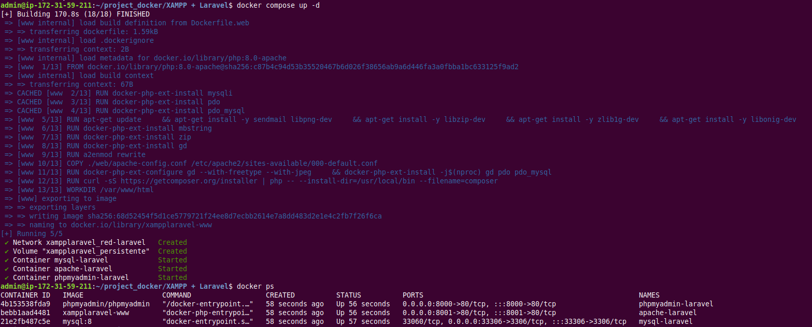
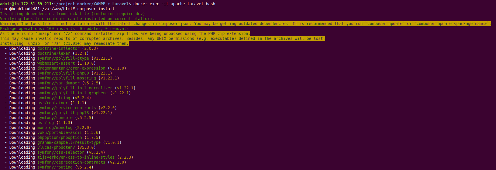
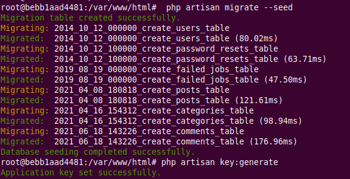
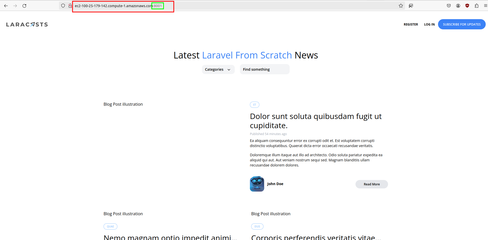
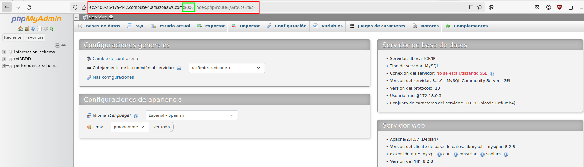

## Instrucciones para levantar el escenario

Este proyecto utiliza PHP 8.

Para ilustrar este despliegue se utiliza una aplicación de muestra, obtenida de aquí: [https://github.com/JeffreyWay/Laravel-From-Scratch-Blog-Project](https://github.com/JeffreyWay/Laravel-From-Scratch-Blog-Project)

Podría desplegarse la aplicación cuando se hiciese el `docker-compose up -d` pero lo he dejado como está para que pueda ser genérico y pueda desplegarse otra aplicación si se prefiere.



Una vez los contenedores están corriendo habría que ir al terminal del contenedor del servidor web:

```console
$ docker exec -it apache-laravel
```
Y una vez dentro del contenedor, instalar dependencias:

```console
# composer install
```

Tras ello se debe crear la BBDD que está indicada en el archivo `.env` del proyecto de Laravel, en mi caso *miBBDD*. Esto se podria hacer desde el phpmyadmin que ya estaría corriendo en **http://localhost:8001** o bien mediante instrucciones por terminal desde el mismo contenedor del servidor web en el que estamos.

!!!danger "¡Cuidado!"
    No es lo mismo el archivo *.env* en la raíz del proyecto Docker que el *.env* en la carpeta de la aplicación PHP:
        
    + El primero contiene variables de entorno para ser utilizadas en el `docker-compose.yml`
    + El segundo contiene variables que usará el código PHP de la aplicación


Tras ello, todavía dentro del contenedor:

```console
# php artisan migrate --seed
```

Y por último:

```console
# php artisan key:generate
```



Este proceso de creación y migración de base de datos sólo debe realizarse una primera vez puesto que hemos configurado un volumen para que todos los datos de MySQL se guarden en nuestro equipo de forma persistente. Esto quiere decir que aunque paremos o destruyamos el contenedor, al volver a crearlo tendremos exactamente los mismos datos.

Ya sólo quedaría darle los permisos adecuados a la carpeta del servidor web para que podamos acceder:

```console
# chown -R www-data:wwww-data /var/www/html
```

Y podremos acceder al blog (o aplicación desplegada) en ***http://localhost:8000*** y a nuestro PHPMyadmin en ***http://localhost:8001*** (en mi caso estoy utilizando AWS, de ahí la URL):






